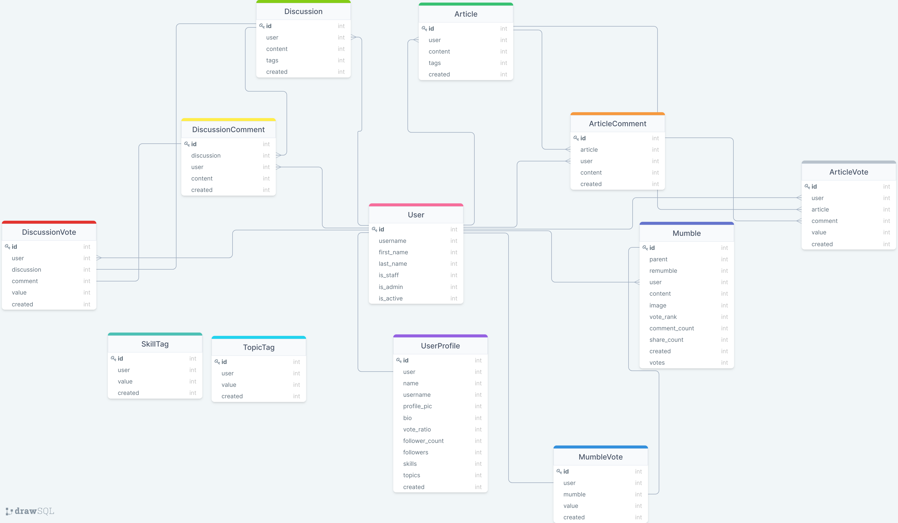

#
<div align="center">

<b>
<span>
API
</span>
</b>
<h1>Welcome to the Mumble Api Repository</h1>

<a href="https://discord.gg/9Du4KUY3dE"></a>
<a href="https://drawsql.app/dennis-ivy/diagrams/mumble"></a>
<a href="http://mumbleapi.herokuapp.com/"></a>
<a href="https://open.vscode.dev/divanov11/mumbleapi.git"></a>


</div>

<br/>

## Getting Started 

If you are trying to use this project for the first time, you can get up and running by following these steps. 

To contribute to this project, please see the [contributing guidelines](https://github.com/divanov11/mumbleapi/blob/master/Contributing.md).
> ⚠ Note, this step assumes you are using **github ssh keys** for the *git clone method*


## The Mumble Diagram

--> *Preview :*

<div align="center">
  <a href="https://drawsql.app/dennis-ivy/diagrams/mumble">

  </a>
</div>

<br/>

--> *Full View:*

You can see clearly the diagram at :&nbsp; <a href="https://drawsql.app/dennis-ivy/diagrams/mumble"></a>


## Requirements 

|                          Technology                          |      Version       |
| :----------------------------------------------------------: | :----------------: |
|           [**Python**](https://docs.python.org/3/)           |      **3.x**       |
|           [**pip**](https://pypi.org/project/pip/)           | **latest version** |
|       [**asgiref**](https://pypi.org/project/asgiref/)       |     **3.3.4**      |
|       [**certifi**](https://pypi.org/project/certifi/)       |   **2020.12.5**    |
|       [**chardet**](https://pypi.org/project/chardet/)       |     **4.0.0**      |
|       [**coreapi**](https://pypi.org/project/coreapi/)       |     **2.3.3**      |
|     [**coreschema**](https://pypi.org/project/coreschema/)|  |     **0.0.4**      |
| [**dj-database-url**](https://pypi.org/project/dj-database-url/) | **0.5.0** |
|     [**Django**](https://docs.djangoproject.com/en/3.2/)     |      **3.2**       |
| [**django-ckeditor**](https://pypi.org/project/django-ckeditor/) |  **6.0.0**  |
| [**django-cors-headers**](https://pypi.org/project/django-cors-headers/) |   **3.7.0**   |
| [**django-heroku**](https://pypi.org/project/django-heroku/) |     **0.3.1**      |
| [**django-js-asset**](https://pypi.org/project/django-heroku/) |     **1.2.2**    |
| [**djangorestframework**](https://www.django-rest-framework.org/) |     **3.12.4**     |
| [**djangorestframework-simplejwt**](https://pypi.org/project/djangorestframework-simplejwt/) |     **4.6.0**      |
|    [**dnspython**](https://pypi.org/project/dnspython/)    |     **2.1.0**      |
|    [**email-validator**](https://pypi.org/project/email-validator/)    |     **1.1.2**      |
|      [**gunicorn**](https://pypi.org/project/gunicorn/)      |     **20.1.0**     |
|    [*idna*](https://pypi.org/project/idna/)   | **2.10**|
|    [*itypes*](https://pypi.org/project/itypes/)   | **1.2.0**|
|    [*Jinja2*](https://pypi.org/project/Jinja2/)   |**3.0.0**|
|    [*MarkupSafe*](https://pypi.org/project/MarkupSafe/)   | **2.0.0**|
|     [**Pillow**](https://pypi.org/project/Pillow/)        |     **8.2.0**      |
|      [**psycopg2**](https://pypi.org/project/psycopg2/)      |     **2.8.6**      |
|         [**PyJWT**](https://pypi.org/project/PyJWT/)         |     **2.0.1**      |
|          [**pytz**](https://pypi.org/project/pytz/)          |     **2021.1**     |
|    [*PyYAML*](https://pypi.org/project/PyYAML/)   | **5.4.1** |
|    [**requests**](https://pypi.org/project/requests/)   | **2.25.1** |
|    [**sentry-sdk**](https://pypi.org/project/sentry-sdk/)   | **1.0.0** |
|           [**six**](https://pypi.org/project/six/)           |     **1.15.0**     |
|      [**sqlparse**](https://pypi.org/project/sqlparse/)      |     **0.4.1**      |
|    [**typing-extension**](https://pypi.org/project/typing-extensions/)   | **3.10.0.0** |
|    [**uritemplate**](https://pypi.org/project/uritemplate/)   | **3.0.1** |
|    [**urllib3**](https://pypi.org/project/urllib3/)   | **1.26.4** |
|    [**whitenoise**](https://pypi.org/project/whitenoise/)    |     **5.2.0**      |


## Install and Run

Make sure you have **Python 3.x** installed and **the latest version of pip** *installed* before running these steps.

To contribute, please follow the [guidelines](https://github.com/divanov11/mumbleapi/blob/master/Contributing.md) process.

Clone the repository using the following command

```bash
git clone git@github.com:divanov11/mumbleapi.git
# After cloning, move into the directory having the project files using the change directory command
cd mumbleapi
```
Create a virtual environment where all the required python packages will be installed

```bash
# Use this on Windows
python -m venv env
# Use this on Linux and Mac
python -m venv env
```
Activate the virtual environment

```bash
# Windows
.\env\Scripts\activate
# Linux and Mac
source env/bin/activate
```
Install all the project Requirements
```bash
pip install -r requirements.txt
```
-Apply migrations and create your superuser (follow the prompts)

```bash
# apply migrations and create your database
python manage.py migrate

# Create a user with manage.py
python manage.py createsuperuser
```
Load test data to your database

```bash

# load data for feed
python manage.py loaddata feeddata.json

# load data for article
python manage.py loaddata articledata.json

# load data for discussion
python manage.py loaddata discussiondata.json
```

Run the tests

```bash
# run django tests for article app
python manage.py test article
```

```bash
# run django tests for discussion app
python manage.py test discussion
```

```bash
# run django tests for feed app
python manage.py test feed
```

```bash
# run django tests for users app
python manage.py test users
```

Run the development server

```bash
# run django development server
python manage.py runserver
```
## Reviewers 

After submitting your PR, please tag reviewer(s) in your PR message. You can tag anyone below for the following.

<br/>

- **Markdown, Documentation, Email templates:**

  [@Mehdi - MidouWebDev](https://github.com/MidouWebDev)

  [@Abhi Vempati](https://github.com/abhivemp/)

#

- **API, Backend, Databases, Dependencies:**

     --> *Choose two reviewers :*

    [@Dennis Ivy](https://github.com/divanov11)
    
    [@Praveen Malethia](https://github.com/PraveenMalethia)

    [@Abhi Vempati](https://github.com/abhivemp)

    [@Bashiru Bukari](https://github.com/bashiru98)

    [@Cody Seibert](https://github.com/codyseibert)

## Explore admin panel for model data or instances

http://127.0.0.1:8000/admin or http://localhost:8000/admin

## Login with the user credentials (you created) using "createsuperuser" cmd

> ⚠ If everything is good and has been done successfully, your **Django Rest API** should be hosted on port 8000 i.e http://127.0.0.1:8000/ or http://localhost:8000/

